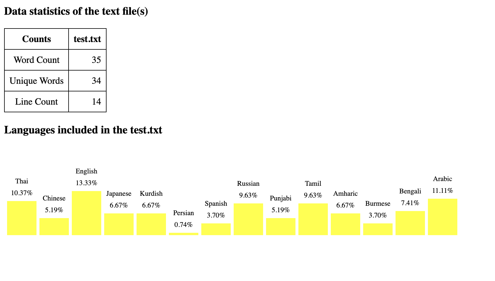
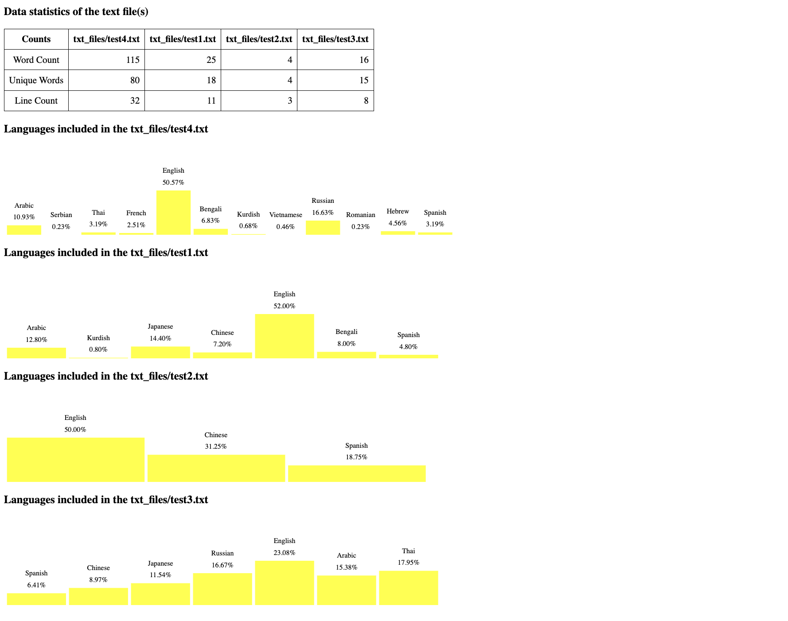

# CorpuX: Text corpus analysis tool

```
$ cargo run -- --help
  CorpuX: Text corpus analysis tool 1.0
  Thura Aung <66011606@kmitl.ac.th>
  Perform various text analysis and generate the report
  
  USAGE:
      corpux [FLAGS] [OPTIONS] <input_path> --mode <mode>
  
  FLAGS:
      -h, --help       Prints help information
      -l, --folder     Specifies whether the input is a folder
      -V, --version    Prints version information
  
  OPTIONS:
      -m, --mode <mode>         Select the analysis mode [possible values: generate, frequency, ngram]
      -n, --nvalue <n_value>    Value of 'n' for n-gram analysis
  
  ARGS:
      <input_path>    The input folder or file to analyze
```

## Features

#### For ONE corpus file analysis
- **Basic text analysis** for each .txt file and text cleaning before it
- **Read and Count** the number of words, lines, and unique words
- **Language Identification** by percentages included in the txt file based on unicode character count
- **Ngram**: generate an n-gram of the file
- **Report Generation**: an HTML report for each .txt file - with a Count table and language percentage bar graph

#### For FOLDER analysis
- Loop all of the .txt files under the folder and generate a report with file information

## Usage
To generate a report for a text file with word count, line count, unique word count and percentage of languages included
```
cargo run -- <input-file> --mode generate
```
```
cargo run -- <input-file> -m generate
```

To generate a report for a folder of text files with word count, line count, unique word count and percentage of languages included
```
cargo run -- --folder <folder-name> --mode generate
```
```
cargo run -- -l <folder-name> -m generate
```

To get word frequency for a specific text file
```
cargo run -- <input-file> --mode frequency
```
```
cargo run -- <input-file> -m frequency
```

To get n-gram for a specific text file
```
cargo run -- <input-file> --mode ngram --nvalue <n-value>
```
```
cargo run -- <input-file> -m ngram -n <n-value>
```

## Demonstration 

```
$ cargo run -- test.txt -m generate   
    Finished dev [unoptimized + debuginfo] target(s) in 0.05s
     Running `target/debug/corpux test.txt -m generate`
Report saved to report.html
```
The following is the screenshot of the generated report.html
.

```
$ cargo run -- -l txt_files -m generate
    Finished dev [unoptimized + debuginfo] target(s) in 0.04s
     Running `target/debug/corpux -l txt_files -m generate`
Report saved to report_folder.html
```

The following is the screenshot of the generated report_folder.html
.
